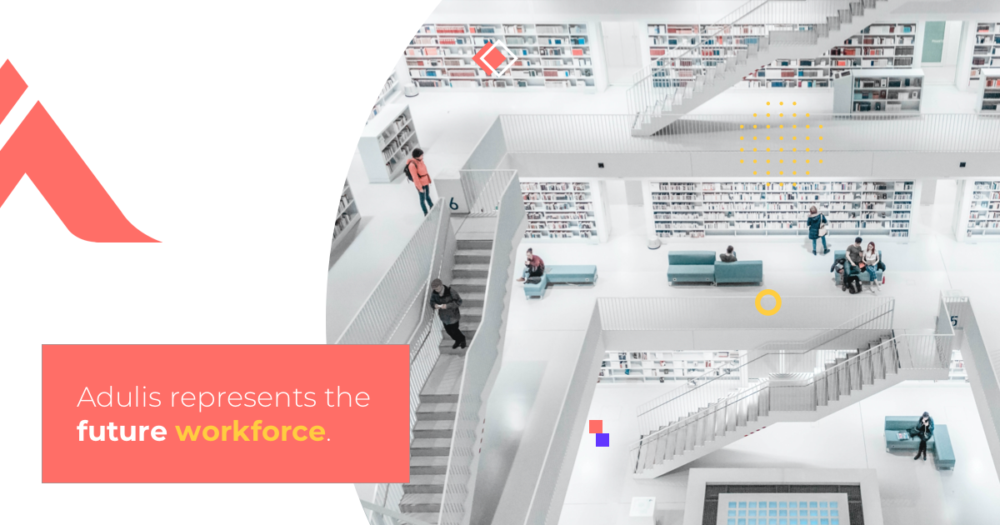

# Adulis

  

  ## Description
   An e-commerce platform both b2b and b2c for the purpose of buying and selling consumer electronics

  ## Table Of Contents
* [Installation](#Installation)
* [Usage](#Usage)
* [Contributing](#Contributing)
* [Credits](#Credits)
* [Features](#Features)
* [Additional] Information(#Additional Information)
  
  ## Installation
            Did you really expect me to know much about installation? lol

  ### Usage
  

  ### Contributing
    Reach out to me via email forst and foremost and I will provide clarification over a ten hour phone call

  ### Credits
  These individual(s): Muktar, Jojo, and Fernando aka my day 1's collaborated with me on this project

  ### Features
  The project will contain a home tab, a blog page, a sell page, a buy page, and links to business social media pages

  ### Additional Information 

  *This project is licensed under the mit license. https://choosealicense.com/licenses/mit/

  **My Github repository nahom-assefa can be found here: potential-galactica**

  **You can contact me at: nahomassefa95@gmail.com**  
  
